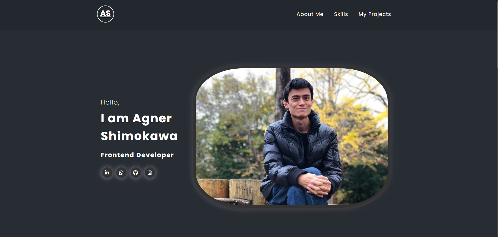

# Portfolio

### 1 - Overview

This portfolio's layout was created by DevEmDobro's brothers and modified by me. 
The main modifications made was the translation of existing text/title to english, replacement of pictures, addition of project made and some tweaks in visual effects.

It was made as part of the course in order for us students to learn how a portfolio is made, and use a existing layout to make changes to create a portfolio of our own. 

Check the final result [here](https://agnershimokawa.github.io/portfolio/).

### 2 - Tweaks and Result

One of the tweaks that I made was change the effect on the icons for the social media links and the first picture. Initially there was a effect that made the icons and the picture pop up, with a light area and a shadow area, I changed that for a circling light going around the icons and picture. For that I used a video tutorial from youtube called:
"CSS Glowing Button - How to Design Glowing Button with Hover Effects"[1](#1).
I also changed the size and shape of the main picture. The result of the modification can be seen in the image bellow.

### Porjects and Curriculum

The projects that are listed on the portfolio are project that were done along the course, and that I was very happy with the result, it's nothing too complex, but I'll be updating them as I do more projects in the future.

The curriculum was more difficult to fill in since currently I don't have much experience in the area, but hopefully soon I have more to write on it.

### Conclusion

It was a fairly large project, it took several mistakes and corrections, a lot of commits made, but it turn out to be a good portfolio in the end, I will be updating it as necessary, but for now it will do.

### Footnotes
<a class="anchor" id="1">1 </a>: Youtube page for the [Glowing Button](https://youtu.be/b_8fHNIHFk4?si=D1nGFcpKst3z4jVL)